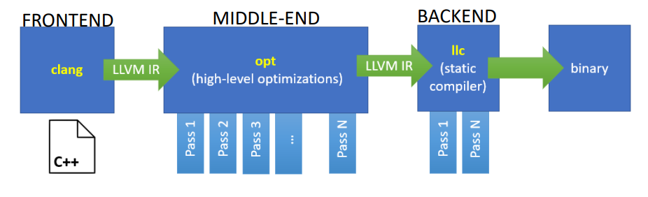

### Ottimizzazioni sui loop
La maggior parte dei programmi spende il grosso del suo tempo di esecuzioni dentro uno o più (hot) loop
- Ottimizzare il loop ha quindi un grande impatto sulla performance dell’intero programma

Le ottimizzazioni sui loop sono spesso propedeutiche a ottimizzazioni machine-specific (effettuate nel backend)
- Register allocation
- Instruction-level parallelism
- Data parallelism (multi-core, SIMD)
- Data-cache locality

I loop sono in generale un target per le ottimizzazioni. Centrali nel parallelismo

### Nota ottimizzazione
Per poter ottimizzare devo trasformare il mio codice in una forma che mi consenta di ignorare i dettagli irrilevanti. In pratica, ho bisogno di modellare il mio codice (e la sua esecuzione a runtime) tramite dei modelli matematici (matrici, alberi, grafi, programmazione lineare, ...) su cui posso ragionare e applicare ottimizzazioni più agevolmente. Applicate le ottimizzazioni ai modelli posso invertire la trasformazione ed ottenere il codice ottimizzato.

### Anatomia di un compilatore
ricordiamo che il termine compilatore è un po' overloaded; non è solo il frontend ma anche l'intera pipeline.

Un compilatore deve svolgere almeno due compiti:
1. **Analisi** del codice sorgente (source)
2. **Sintesi** di un programma in linguaggio macchina (target)

Per svolgere i suoi due compiti opera su una **Rappresentazione Intermedia (IR)** e viene suddiviso in tre parti principali:
- Il blocco **Front-end** produce la IR
- Il blocco **Middle-end** (optimizer) trasforma la IR **in vari passi** in una versione più efficiente
- Il blocco **Back-end** trasforma la IR nel codice target

Nel caso di llvm:
- L’ottimizzatore LLVM (opt)
    - È organizzato in una serie di passi di analisi/trasformazione.
    - Il pass manager stabilisce in che ordine applicare i passi per un dato obiettivo
- NOTA: Esistono passi di ottimizzazione anche nel backend (llc)

### Perché usare una IR?
1. Principio di Ingegneria del Software (modularità)
    - Spezza il compilatore in parti più gestibili
2. Semplifica il retargeting ad un nuovo ISA
    - Isola il Back-end dal Front-end 
    - se voglio supportare una nuova architettura mi basta scrivere un nuovo backend
3. Semplifica il supporto a molti linguaggi
    - Diversi linguaggi condividono Middle e Back-end
    - se voglio supportare un nuovo linguaggio mi basta scrivere un nuovo frontend
4. Abilita ottimizzazioni machine-independent
    - Tecniche generali, multipli passi
    - posso ottimizzare la rappresentazione intermedia, sempre uguale per ogni frontend, indipendentemente dalla mia architettura target