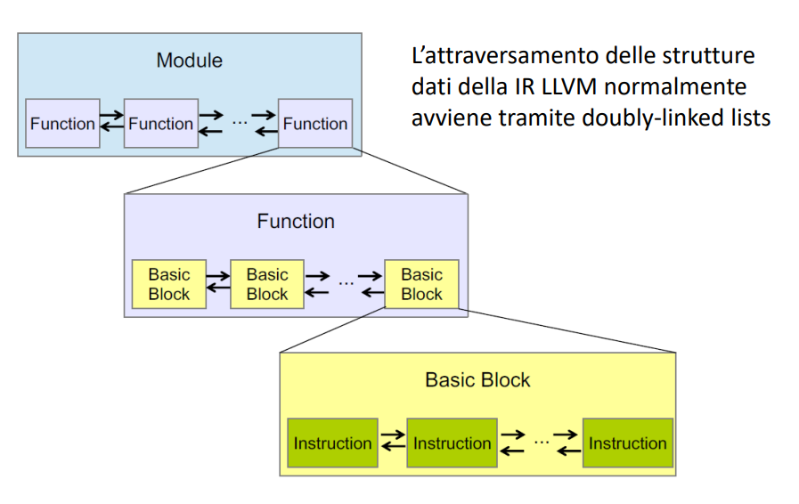
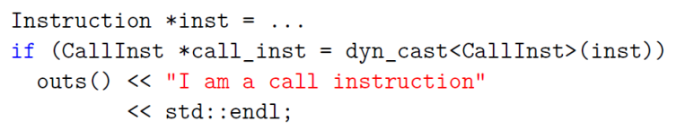

Abbiamo visto che il l'ottimizzatore nel middle-end è organizzato come una **sequenza di passi**
- Passi di analisi
    - Consumano la IR e raccolgono informazioni sul programma
- Passi di trasformazione
    - Trasformano il programma e producono nuova IR

Perché esiste questo isolamento?
- L'output di un passo potrebbe essere l'input di molti altri passi
- L’isolamento evita analisi ridondante
- Migliore leggibilità

## Come scrivere un passo LLVM?
Per rispondere a questa domanda bisogna prima comprendere i seguenti punti:
- **Moduli LLVM**: Come è tradotto il nostro programma in LLVM?
- **Iteratori**: Come attraversare il modulo?
- **Downcasting**: Come ricavare maggiori informazioni dagli iteratori?
- **Interfacce dei passi LLVM**: Che interfacce fornisce LLVM per scrivere i passi?

### Moduli LLVM

| **Il nostro programma**  | ⟶  | **Un Modulo LLVM**  | |
|--------------------------|----|---------------------|----------|
| **Files**                | ⟶  | **Module**          | lista di `Function` e **variabili globali** |
| **Funzioni**             | ⟶  | **Function**        | lista di `BasicBlocks` (sequenze di istruzioni viste nei CFG) e **argomenti** |
| **Basic Blocks**         | ⟶  | **BasicBlock**      | lista di `Instruction` |
| **Istruzioni**           | ⟶  | **Instruction**     | **Opcode** e **operand** |

### Iteratori
Iteratori C++
- moving the iterator p forward one element at a time using ++
- and looking at the elements using the dereference operator ∗.
    - sembra che gli elementi siano sempre delle references

### Downcasting
In C++ il downcasting è l'operazione di conversione di un puntatore o riferimento ad una classe base, verso una classe derivata.
- Restituisce nullptr se il cast fallisce (per i puntatori) o lancia std::bad_cast (per i riferimenti).

Perché ci serve il Downcasting?
- Immaginiamo di avere una Instruction
    - Come facciamo a sapere se è un’istruzione unaria o binaria?
    - O capire se è una branch instruction o una call instruction?
- Il Downcasting ci aiuta a recuperare maggiore informazione dagli Iterators
    - In pratica facciamo delle operazioni simili a quelle di una tagged union

Es:

### Interfacce dei passi LLVM
LLVM fornisce diverse interfacce per i passi
- _BasicBlockPass_: itera sui basic blocks
- _CallGraphSCCPass_: itera sui nodi del call graph
- _FunctionPass_: itera sulla lista delle funzioni nel modulo
- _LoopPass_: itera sui loops, in ordine inverso di nesting
- _ModulePass_: generico passo interprocedurale
- _RegionPass_: itera sulle SESE regions, in ordine inverso di nesting

Come si usano lo vediamo tra un po'

## Pass manager
Il pass manager stabilisce in che ordine applicare i passi per un dato obiettivo
- Il pass manager del middle-end ha una sequenza di default di applicazione dei passi
- Il default si può alterare invocando una sequenza arbitraria di passi tramite linea di comando
    - opt -passes='pass1,pass2' /tmp/a.ll -S

## Esercizio 1 | osservazione dell'IR
La IR di LLVM ha una sintassi ed una semantica simile a quelle del linguaggio Assembly a (es., RISC-V)
- ha una forma SSA

Per produrre la IR da dare in pasto al middle-end ci serve clang (il frontend)
- clang -O2 -emit-llvm -S -c test/Loop.c -o test/Loop.ll

| Opzione           | Significato                                                                                   |
|-------------------|-----------------------------------------------------------------------------------------------|
| `clang`           | È il frontend del compilatore LLVM, usato per compilare codice C/C++ e produrre IR LLVM o codice oggetto. |
| `-O2`             | Applica ottimizzazioni di livello 2. Questo livello bilancia performance e tempo di compilazione. Influisce sulle trasformazioni applicate all’IR. |
| `-emit-llvm`      | Indica a Clang di generare LLVM IR anziché codice macchina nativo.                           |
| `-S`              | Dice a Clang di produrre output in formato testuale (assembly-like), invece di un file binario `.bc`. Risultato: `.ll`. |
| `-c`              | Compila il file, ma non esegue il linking (utile per produrre file intermedi come IR o oggetto). |
| `test/Loop.c`     | È il file sorgente C da compilare.                                                            |
| `-o test/Loop.ll` | Specifica il file di output: in questo caso, il file IR in formato `.ll`.                     |

NOTA: prova ad usare anche il flag -Rpass=.* di Clang (e LLVM in generale) è uno strumento diagnostico usato per **stampare informazioni sulle ottimizzazioni che hanno avuto successo durante la compilazione**.

**conclusioni**
- con -O2 viene ottimizzata via un sacco di roba
    - la chiamata alla funzione
    - il loop 
    - variabili inutili
- con -O le cose vengono fatte molto più alla lettera
    - non sono presenti le ottimizzazioni di sopra
    - ad es. carica g invece di restituire direttamente la somma

## Esercizio 2 | aggiungere un passo di analisi 