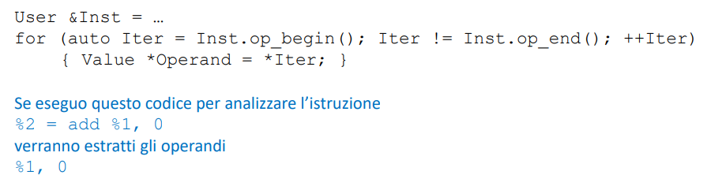

Abbiamo visto che il middle-end è organizzato come una sequenza di passi
- Passi di analisi: Consumano la IR e raccolgono informazioni sul programma
- **Passi di trasformazione: Trasformano il programma e producono nuova IR**

La IR di LLVM utilizza la forma SSA (Static Single Assignment), per la quale una variabile non può essere definita più di una volta
- La forma SSA è stata proposta come framework per **semplificare l’ottimizzazione della IR** a valle di tanti anni di ricerca sulla dataflow analysis

Ci sono molte APIs per manipolare le istruzioni nella IR ed effettuare le ottimizzazione
- Instruction, BasicBlock, ecc.
- bisogna leggere la documentazione :(


Supponiamo di dover ottimizzare il seguente codice:

```
    %2 = add %1, 0 ; Identità algebrica
    %3 = mul %2, 2
```

È evidente che la prima istruzione contiene una identità algebrica e posso farne a meno
- Ma cosa succede se semplicemente rimuovo l’istruzione?
    - Il programma va in crash, perché non ho aggiornato le references correttamente
    - dovrei sostiture %2 con %1 nel secondo assegnamento
- Come possiamo assicurarci che tutte le references (cioè gli usi) siano aggiornate correttamente?
    - **Sfruttando le relazioni User - Use - Value di LLVM**


### User - Use - Value
- Le istruzioni (_Instruction_) LLVM ereditano dalla classe _Value_ (come quasi tutte le classi LLVM)
- Ma ereditano anche dalla classe _User_
- Quindi esiste implicitamente un legame tra le istruzioni e i loro usi
- In altre parole, le Instruction giocano entrambi i ruoli di _User_ e Usee (_Value_)
- nel specifico, la catena di ereditarietà è la seguente:
    - _Instruction_ -> _User_ -> _Value_


#### Value
La classe Value è la più importante classe base in LLVM, dato che quasi tutti i tipi di oggetto ereditano da questa 
- Un nodo Value ha un tipo (es., integer, floating point): 
    - getType()
- Un nodo Value può avere o meno un nome: 
    - hasName(), getName()
- Soprattutto, **un nodo Value ha una lista di Users che lo utilizzano**
    - Le istruzioni, in quanto Value, hanno anch'esse una lista di Users

#### Istruzioni come User
Un oggetto Instruction è anche un oggetto User

Ogni User (Instruction) **ha una lista di valori che sta utilizzando**.
- Questi valori sono **gli operandi dell’istruzione**, e sono oggetti di tipo Value.




#### Istruzioni come Usee
Perché un oggetto Instruction è anche uno Usee?
- La risposta risiede nel come dobbiamo interpretare un oggetto Instruction LLVM:
    - %2 = add %1, 0
    - Il risultato dell’istruzione add %1, 0 viene assegnato a %2 -> NO
    - **%2 è la rappresentazione Value dell’istruzione add %1, 0** -> SI

Quindi, **ogni volta che nel testo usiamo il valore %2 in realtà intendiamo proprio indicare l’istruzione add %1, 0**
- gli user di una istruzione considerata come usee sono le istruzioni che contegono come operando l'istruzione usee

#### Esempio 
... 